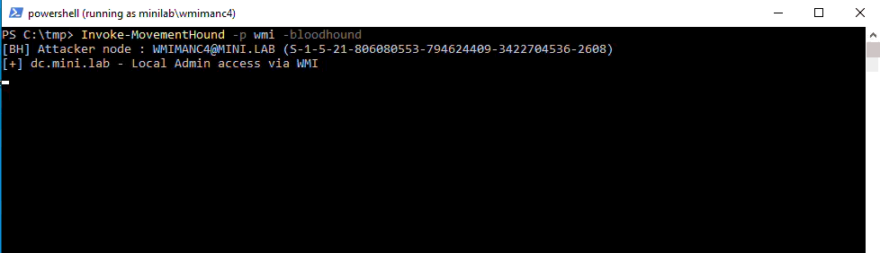

<p align="center">
  
</p>

<p align="center">
  <em>Catch what slips past group-based enumeration, move it. 🐾</em>
</p>

<p align="center">
  <a href="LICENSE"></a>
  
  
  
</p>

---

## Table of Contents

- [TL;DR](#tldr)
- [Why MovementHound?](#why-movementhound)
- [How it works](#how-it-works)
- [Techniques & modules](#techniques--modules)
- [Requirements](#requirements)
- [Installation](#installation)
- [Usage](#usage)
- [Extending BloodHound](#extending-bloodhound)
- [Output](#output)
- [Roadmap](#roadmap)
- [Detection & defensive notes](#detection--defensive-notes)
- [Credits & acknowledgements](#credits--acknowledgements)
- [Disclaimer](#disclaimer)
- [License](#license)

---

## TL;DR

**MovementHound** is a PowerShell tool that performs **active enumeration** of lateral movement capabilities on Windows, based on the **effective rights a principal actually holds** not on the group it happens to belong to.

Most tooling decides "can this user move here?" by checking group membership (`Administrators`, `Remote Management Users`, `Distributed COM Users`, …). That is fast, quiet and **unreliable** in any environment where DACLs and security descriptors have drifted from the defaults (which, in the real world, is most of them). MovementHound trades stealth for **reliable, unambiguous results**: it probes the target the way an operator would, surfaces the access you really have, and can feed the result straight back into **BloodHound Legacy** as new edges.

One script, one consistent output, every overlooked path in one pass.

---

## Why MovementHound?

**Group membership is a poor proxy for what a principal can do.** Windows bases almost all of its access control on DACLs and security descriptors, and those get rewritten constantly by administrators papering over "how does a non-admin start a service?", and by third-party installers silently loosening descriptors so their service accounts work.

That gap is inherent to any enumeration approach that infers access from group membership rather than probing it directly, for example:

- A custom per-AppID launch/activation ACE grants DCOM execution without Distributed COM Users membership.
- An Execute (Invoke) ACE on the PowerShell endpoint SDDL grants PSRemoting without Remote Management Users membership.
- On modern systems, enumerating remote group membership itself requires local admin on the target, so group-based checks go blind precisely on the machines where you don't already have admin, which are the interesting ones.

> If you have valid credentials for a user that *isn't* in the Administrators group, or you lack readable/writable shares, **it is always worth investigating further.** MovementHound is what does the investigating.

A second reason this matters: many of these minimal rights primitives double as **persistence**. During an assessment of a previously breached environment, MovementHound helps you verify whether such low privilege footholds were left behind.

> Naming note: switching to `PersistenceHound` was on the table, but the primary use during assessments is still lateral movement, so the name stays.

A final reason is that several tools rely on different techniques. During an engagement, having an all‑in‑one script that handles all of this can be convenient, so you don’t risk forgetting one.

---

## How it works

**Reliability over OPSEC by design.**

MovementHound was built for controlled environments and authorized assessments, where sacrificing stealth to get a definitive answer is not only acceptable but often the whole point. Rather than inferring access from group membership, it attempts the operation (or the exact handle/access-mask request that the operation needs) and reports what actually succeeds.

A few design consequences worth knowing up front:

- **It is active and therefore noisy.** It opens handles, touches named pipes over SMB, and probes endpoints. This is intentional. (An OPSEC-leaning mode is on the [roadmap](#roadmap).)
- **It runs modules in parallel** to keep runtimes sane, but reliability still costs time. Expect total runtime to scale primarily with the number of hosts in scope, leave it running.
- **It requests the *minimum* access mask** each technique needs, not `*_ALL_ACCESS`. That is what lets it see paths that admin-centric checks (which probe for `SC_MANAGER_ALL_ACCESS`, `0xF003F`, and friends) report as "no access".

---

## Techniques & modules

MovementHound consolidates a set of standalone scripts (`Find-SCMAccess`, `Find-DCOMLocalAdminAccess`, and others) into a single unified collector. The table below lists what it enumerates, with the **effective rights** each path really needs, the part that admin/group checks miss.

| Module | Technique | Effective rights it checks for (the part you'd miss) |
| --- | --- | --- |
| **SCM&nbsp;Create** | Remote **service creation**, bypassing the `OpenService` call | SCM `0x0003` = `SC_MANAGER_CREATE_SERVICE` + `SC_MANAGER_CONNECT` |
| **SCM&nbsp;Reconfig** ⭐ | **Service reconfiguration** (`ChangeServiceConfig`) | SCM `0x0001` (`SC_MANAGER_CONNECT`) + service `0x0002` (`SERVICE_CHANGE_CONFIG`) |
| **WMIMAN** ⭐ | **WMI over WSMAN** | `Remote Management Users` group membership and `WBEM_REMOTE_ENABLE(0X20)` |
| **WMI**  | **WMI over DCOM** | `COM_RIGHTS_EXECUTE, _EXECUTE_REMOTE (0x5)` and `WBEM_REMOTE_ENABLE(0X20)` |
| **DCOM** | DCOM exec via `MMC20`, `ShellWindows`, `ShellBrowserWindow`, `Excel` | Per-AppID Launch/Activation ACEs, *not* just `Distributed COM Users` |
| **WinRM&nbsp;/&nbsp;WinRS** | PSRemoting (`Microsoft.PowerShell` SDDL) **and** WinRS (RootSDDL) | `Execute (Invoke)` on the endpoint SDDL / service **RootSDDL** , checked separately, because one can work when the other doesn't |
| **Remote&nbsp;Registry** ⭐ | `winreg` + `AllowedPaths`, plus service / Task Scheduler (GhostTask) / Autorun / COM-Hijack / Network-provider keys | `SetValue` / `CreateSubKey` (also via WriteOwner/WriteDAC) on the target key (+ `winreg` ACL or an `AllowedPaths` exemption) |
| **RDP** [beta] | `CanRDP` (interactive logon) | `Remote Desktop Users` **and** `SeRemoteInteractiveLogonRight`, evaluated as *effective*, including Remote Credential Guard |
| **RDP&nbsp;Shadow** [beta] ⭐ | Session shadowing (`mstsc /shadow`) | RDP-Tcp / console `0x00011` = `WINSTATION_QUERY` + `WINSTATION_SHADOW` (full control not required) |
| **SSH** | OpenSSH, with **Plink fallback** (incl. `GSS-API`) | valid creds + `AllowUsers` / `AllowGroups` / `DenyUsers` / `DenyGroups` evaluation |
| **URA [soon]** | **User Right Assignment** abuse | abusable rights (e.g. paths to `SYSTEM`) read from `GptTmpl.inf` in **SYSVOL**, enumerable from any low priv domain account |

⭐ = frequently **overlooked** during assessments. Common/well-known techniques are also covered even where they aren't starred. For the protocol-level detail behind each one, read the [series](https://pol4ir.github.io/posts/LateralMovement-WhatYouReallyNeed/).

---

## Requirements

- **Windows** host to run from (operator box or beachhead).
- **PowerShell 5.1** or **PowerShell 7+**.
- Valid **domain credentials**/**sessions** (the whole point is that they need *not* be admin).
- Line of sight to the targets over the relevant transports (SMB/445, RPC/135 + ephemeral, WinRM/5985-5986, RDP/3389, SSH/22, …) depending on the modules you run.

---

## Installation

```powershell
# 1) Grab the script
git clone https://github.com/pol4ir/MovementHound.git
cd MovementHound

# 2) Allow it to run for this session (adjust to your policy)
Set-ExecutionPolicy -Scope Process -ExecutionPolicy Bypass -Force

# 3) Dot-source it
. .\MovementHound.ps1
```

Or load it straight into memory:

```powershell
IEX (New-Object Net.WebClient).DownloadString('https://raw.githubusercontent.com/pol4ir/MovementHound/main/MovementHound.ps1')
```

The entry point is `Invoke-MovementHound`.

---

## Usage

### Full
```powershell
# Enumerate access across the domain using all techniques
Invoke-MovementHound -lhost <IP>

# Same, but also emit BloodHound Legacy edges
Invoke-MovementHound -lhost <IP> -bloodhound
```

### Technique-oriented
Pick a method with `-p` and let it run:

```powershell
# Enumerate SSH access across the domain
Invoke-MovementHound -p "ssh,wmi"

# Same, but also emit BloodHound Legacy edges
Invoke-MovementHound -p "ssh,wmi" -bloodhound
```

`-p` selects the technique to probe: service creation (SCM) and reconfiguration, DCOM, WinRM/WinRS, WMI / WMIMAN, Remote Registry, RDP, SSH, and more. Targets are discovered from the domain by default.

A typical run looks like this:

```text
PS C:\tmp> Invoke-MovementHound -p wsman -bloodhound
[BH] Attacker node : WINRMC5@MINI.LAB (S-1-5-21-806080553-794624409-3422704536-2609)
[+] dc.mini.lab - Local Admin access via WinRM/WSMAN
[BH] Building BloodHound Legacy output...
[BH] ZIP saved : C:\tmp\MovementHound_BH_20260623_084015.zip
[BH] Edges     : 1  Computers: 1
[BH] Edge map  :
        WINRMC5@MINI.LAB --[CanPSRemote (WinRM/CIM)]--> dc.mini.lab
[BH] Drag-and-drop the ZIP into BloodHound Legacy to import.
```

---

## Extending BloodHound

The `-bloodhound` switch turns MovementHound into a **collector for BloodHound Legacy**, extending the graph with the effective access edges it discovers. It writes a timestamped ZIP (e.g. `MovementHound_BH_20260623_084015.zip`) that you **drag and drop** into BloodHound Legacy to import.

The point is the **before / after**. For example:

| | BloodHound (group-based) | BloodHound **+ MovementHound** |
| --- | --- | --- |
| User **not** in `Remote Management Users`, but granted `Execute (Invoke)` on the endpoint SDDL | ❌ no `CanPSRemote` edge | ✅ `CanPSRemote` edge appears |
| User with a custom per-AppID DCOM ACE, not in `Distributed COM Users` | ❌ no `ExecuteDCOM` edge | ✅ edge surfaced |
| Target where you aren't local admin | ❌ `CanRDP` invisible (remote group enum needs admin) | ✅ access determined by probing, not membership |

<p align="center">
  
  &nbsp;&nbsp;
  
</p>

---

## Output

<p align="center">
  
</p>

- Human-readable console output (`[+]` for hits) for live triage.
- A BloodHound Legacy ZIP when `-bloodhound` is set, ready for drag-and-drop import.

---

## Roadmap

In no particular order:

1. **Python implementation** (to leverage Impacket and friends) with Unix-like compatibility.
2. **OPSEC mode**, skip active enumeration where possible, prefer RPC over TCP/IP instead of named pipes over SMB.
3. **Session 0 support** for RDP and RDP shadowing via raw network protocols.
4. **More registry-based techniques** (sticky keys, RDP-shadowing keys, `LocalServer32`, …).
5. **Performance** e.g. use `winreg` status checks to skip unnecessary Remote Registry scans.
6. **Legacy support**, `shadow.exe` for RDP shadowing on older systems.
7. **Accurate RDP detection**, distinguish authentication success (NLA/CredSSP OK) from real authorization (an actual interactive session).
8. **Credential support via parameters.**

PRs welcome, this opened up to the community precisely so it can grow. I'm happy to integrate new techniques rather than reinvent wheels.

---

## Detection & defensive notes

The same checks that surface lateral movement paths for red teams give blue and purple teams a concrete list of misconfigurations to close and detections to validate. The examples below are just a starting point.

**Things to hunt for**
- Service creation / change: Event ID **7045** (service installed) and **7036** (state change); System log and Service Control Manager events.
- Named-pipe access over SMB to `\pipe\svcctl`, `\pipe\winreg` and more.
- WinRM/WSMAN sessions spawning `wsmprovhost.exe`; WMI activity under `wmiprvse.exe`; scheduled-task host `taskhostw.exe`.
- RDP-shadowing artifacts: `RdpSa.exe` inbound on dynamic ports, `mstsc /shadow` usage.

**Things to fix (the root cause)**
- Audit the **SCM security descriptor** and individual **service DACLs** for over permissive ACEs granting non-admins create/reconfigure/start. Remember the Win10 1709 / Server 2016 1709 policy that blocks non-admin SCM callers, verify it's effective (registry exemptions can quietly disable it).
- Review the **`winreg`** key ACL and the **`AllowedPaths\Machine`** exemption list under `SecurePipeServers`.
- Tighten the **WinRM RootSDDL** and the **`Microsoft.PowerShell` endpoint SDDL**.
- Audit per-AppID **DCOM** launch/activation permissions.
- Audit **WinStation** descriptors (`RDP-Tcp`, `ConsoleSecurity`, `DefaultSecurity`) for stray `WINSTATION_SHADOW`.
- Review **User Right Assignments** in GPOs for principals that shouldn't hold escalation capable rights.

---

## Credits & acknowledgements

This tool includes other people's work:

- **Nikhil Mittal** ([@samratashok](https://twitter.com/nikhil_mitt)): research and scripting work, some of which is integrated here.

- **SpecterOps & the BloodHound team**: for BloodHound and the whole `*Hound` ecosystem this plugs into.

---

## Disclaimer

MovementHound is intended **exclusively for authorized security testing, research, and defensive use.** Run it **only** against systems you own or for which you have **explicit, written permission** to test. Because it performs *active* enumeration, it is inherently intrusive and may be logged, may trip detections, and may affect target systems. **You are solely responsible** for how you use it and for complying with all applicable laws and contracts. The author(s) accept no liability for misuse or for any damage caused. **If you do not have authorization, do not run this.**

---

## License

Released under the **GPL-3.0** license — see [`LICENSE`](LICENSE).

---